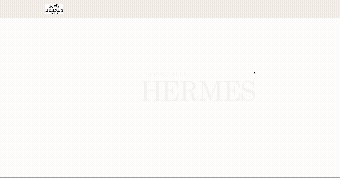

# 🍊 **`hermes` 사이트 리뉴얼 프로젝트**

### ✨ **반응형 웹 리뉴얼 및 포트폴리오**

사용자 경험(UX) 향상과 모바일 최적화를 목표로 React.js를 사용하여 에르메스 공식 사이트의 메인 페이지를 리뉴얼했습니다.

🔗 **배포 링크:** [https://ijieun0123.github.io/hermes/](https://ijieun0123.github.io/hermes/)

---

### 🚀 **프로젝트 목표 및 동기**

-   **동기:** 기존 사이트의 레거시 디자인을 현대적인 UI/UX 트렌드에 맞게 개선하고, 성능 좋은 **Vite** 환경에서 **React.js**를 활용한 컴포넌트 기반 개발 경험을 쌓기 위해 진행했습니다.
-   **주요 목표:** 모바일 퍼스트 디자인을 적용하여 모든 디바이스에서 최적의 사용성을 보장하고, 동적인 애니메이션 효과를 통해 사용자 참여도를 높이는 것입니다.

---

### 🛠️ **기술 스택 (Development Environment)**

|      구분      | 기술 스택                   | 설명                                                                  |
| :------------: | :-------------------------- | :-------------------------------------------------------------------- |
|    **언어**    | `TypeScript`                | 정적 타입 체크를 통한 코드 안정성 확보                                |
| **프레임워크** | `React.js`                  | 컴포넌트 기반의 UI 개발                                               |
|   **번들러**   | `Vite`                      | 빠르고 효율적인 개발 환경 및 빌드 속도                                |
|  **스타일링**  | `Styled-Components`, `SCSS` | 컴포넌트 레벨 스타일링 및 반응형 미디어 쿼리 관리                     |
| **애니메이션** | `AOS.js`                    | 스크롤 위치 기반의 동적 애니메이션 처리                               |
|  **슬라이더**  | `Swiper.js`                 | 복잡한 요구사항(Coverflow, Loop)을 처리하는 유연한 슬라이드 기능 구현 |
|   **패키지**   | `Yarn`                      | 의존성 관리                                                           |

---

### 🛠 핵심 기술 구현 상세

<b>1. TypeScript를 통한 "Type-Safe UI" 구현</b>

 

-   **엄격한 데이터 관리:** 모든 UI 데이터와 Props에 Interface를 적용하여 데이터 구조를 엄격하게 관리했습니다.
-   **오류 차단 및 생산성 향상:** 협업 시 발생할 수 있는 데이터 타입 불일치 오류를 사전에 차단하고, 자동 완성 기능을 통해 개발 생산성을 높였습니다.

<b>2. Styled-components 기반의 컴포넌트 주도 설계 (CDD)</b>

 

-   **Children Props를 통한 컴포넌트 확장성:** 동일한 버튼 레이아웃 내에서 `children` props를 활용하여 버튼 텍스트를 유동적으로 변경할 수 있도록 설계했습니다. 이를 통해 하나의 컴포넌트로 다양한 맥락의 버튼을 생성하는 재사용성을 확보했습니다.
-   **컴포넌트 단위 스타일 캡슐화:** 각 컴포넌트의 스타일을 내부에서 정의하여 외부 스타일과의 충돌을 방지하고 코드의 독립성을 확보했습니다.
-   **유지보수 효율 극대화:** 공통 UI 요소를 독립적인 부품 단위로 분리하여, 스타일 변경 시 해당 컴포넌트만 수정하면 프로젝트 전체에 즉각 반영되는 효율적인 구조를 구축했습니다.

<b>3. "Pixel-Perfect"를 지향하는 정밀한 UI 구현</b>

 

-   **수치 기반의 완벽한 재현:** 피그마 시안의 절대 수치를 분석하여 브라우저 환경에 맞는 상대 비율(%)로 정밀하게 환산했습니다. 어떤 해상도에서도 디자인 의도가 오차 없이 유지되도록 구현했습니다.
-   **유연하고 견고한 반응형 설계:** 주요 중단점(768px, 1024px, 1440px)별로 폰트 크기, 자간, 여백 등을 재설정하여 단순 유동형 레이아웃에서 발생할 수 있는 시각적 불균형을 해소했습니다.
-   **전략적 콘텐츠 노출 관리:** `hide_on_mobile` 클래스 등을 활용해 기기별 최적화된 콘텐츠만 노출함으로써, 화면 크기에 상관없이 시각적 밸런스가 맞는 인터페이스를 제공하는 데 집중했습니다.

<b>4. 사용자 경험을 고려한 인터랙션 및 라이브러리 최적화</b>

 

-   **입체적인 Collections 슬라이더 구현:** `CollectionsSwiper`에서 `EffectCoverflow` 모듈을 활용하여 슬라이드에 깊이감과 회전 효과를 부여했습니다. 특히 `initialSlide`, `centeredSlides` 옵션을 조합하여 메인 슬라이드가 중앙에 오도록 배치하고, 해상도별로 `slidesPerView`와 `spaceBetween`을 정밀하게 조정하여 우아한 레이아웃을 완성했습니다.
-   **해상도별 슬라이드 가시성 최적화:** `ProductSwiper`에서 모바일(1개 노출)과 데스크탑(8개 노출)의 슬라이드 비중을 극명하게 차등 설계하여 가독성과 정보 전달력을 동시에 확보했습니다.
-   **브랜드 무드에 맞춘 인터랙션:** `AOS.js`를 활용하여 콘텐츠 등장 시점에 적절한 지연 시간을 부여함으로써, 사용자의 시선 흐름에 맞춘 리듬감 있는 브랜드 경험을 연출했습니다.

<b>5. SCSS 시스템 설계 및 모듈화 작업</b>

 

-   **디자인 시스템의 변수화 (\_variables.scss):** 컬러, 폰트 규격, 행간, 자간 등을 시스템 변수로 정의하여 프로젝트 전반에 걸쳐 일관된 UI 구현 및 유지보수 효율을 높였습니다.
-   **스타일 패턴의 재사용 (\_mixins.scss):** 반복되는 CSS 속성을 믹스인으로 모듈화하여 코드 중복을 최소화했습니다.
-   **반응형 가이드 및 레이아웃 설계 (\_common.scss):** 정밀한 해상도별 비율 계산을 통해 `.container`를 규격화하고, 텍스트 위계에 따른 공통 클래스를 관리하여 스타일 파편화를 방지했습니다.
-   **구조적 스타일 관리:** 스타일 시트를 `reset`, `variables`, `mixins`, `common`으로 분리하여 관리함으로써 유지보수가 용이한 구조를 지향합니다.

---

### 트러블슈팅

<b>1. 다층 레이어 구조의 정밀 좌표 설계 및 반응형 최적화</b>

 

-   **Challenge:** `Our Story` 섹션에서 배경 박스, 메인 이미지, 타이포그래피, 텍스트 상자가 서로 복잡하게 겹치는 디자인을 구현해야 했습니다. 일반적인 배치 방식으로는 요소들이 서로 밀려나거나 겹침의 순서가 꼬이는 등 디자인 의도를 유지하기 어려운 난관이 있었습니다.
-   **Solution:**
    -   **Z-index와 절대 좌표 활용:** 섹션 전체에 `position: relative`를 부여하고 내부 요소들을 `absolute`로 띄워 Z-index를 활용한 층위 설계를 진행했습니다. 이를 통해 박스와 이미지가 서로 겹치면서도 레이아웃이 무너지지 않는 입체적인 공간감을 완성했습니다.
    -   **해상도별 배치 전략 차별화:** 모바일에서는 사용자가 내용을 위에서 아래로 편하게 읽을 수 있도록 요소들을 순서대로 나열하는 방식을 취했습니다. 반면, 데스크탑에서는 퍼센트(%) 단위의 정밀한 좌표값과 텍스트 회전(`rotate`) 기법을 활용하여 시안과 오차 없는 화려한 레이아웃을 재현했습니다.
-   **Result:** 어떤 해상도에서도 요소들이 디자인 의도대로 정밀하게 배치되며, 에르메스 특유의 감각적인 UI를 성공적으로 재현했습니다.

---

### 🗓️ **개발 기간**

-   **총 기간:** 8일
-   **진행 기간:** 2025. 09. 18 ~ 2025. 09. 25

---

### 🖼️ **스크린샷**

##### animation

##### 1920px

##### 1024px

##### 768px

##### 360px

