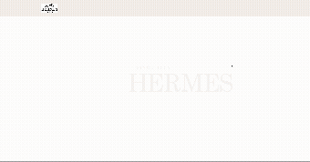

# 🍊 Hermès (에르메스) Web Renewal Project

### ✨ **반응형 웹 리뉴얼 및 포트폴리오**

사용자 경험(UX) 향상과 모바일 최적화를 목표로 Vite 환경에서 React.js를 사용하여 에르메스 공식 사이트의 메인 페이지를 리뉴얼했습니다.

🔗 **배포 링크:** [https://ijieun0123.github.io/hermes/](https://ijieun0123.github.io/hermes/)

---

### 🚀 **프로젝트 목표 및 동기**

-   **동기:** 기존 사이트의 레거시 디자인을 현대적인 UI/UX 트렌드에 맞게 개선하고, 성능 좋은 **Vite** 환경에서 **React.js**를 활용한 컴포넌트 기반 개발 경험을 쌓기 위해 진행했습니다.
-   **주요 목표:** 모바일 퍼스트(Mobile-First) 디자인을 적용하여 모든 디바이스에서 최적의 사용성을 보장하고, 동적인 애니메이션 효과를 통해 사용자 참여도를 높이는 것입니다.

---

### 🖼️ **주요 구현 기능 및 스크린샷**

#### 핵심 기능

-   **반응형 레이아웃:** 360px (Mobile)부터 1920px (Desktop)까지 최적화된 유동적인 레이아웃을 제공합니다.
-   **스크롤 애니메이션 (AOS):** `AOS.js`를 활용하여 콘텐츠가 동적으로 나타나는 효과를 구현하여 시각적 즐거움을 더했습니다.
-   **고급 슬라이더 (Swiper.js):**
    -   **Desktop:** `Coverflow Effect`를 적용한 3D 슬라이더를 구현했습니다.
    -   **Mobile:** `Pagination`을 활용한 기본 슬라이더로 전환되도록 반응형을 완벽하게 처리했습니다.
-   **Custom Styling:** `Styled-Components`와 `SCSS`를 병행하여 스타일링의 재사용성과 효율성을 높였습니다.

#### 화면 별 스크린샷

##### animation

##### 1920px

##### 1024px

##### 768px

##### 360px

### 🛠️ **기술 스택 (Development Environment)**

|      구분      | 기술 스택                   | 설명                                                                  |
| :------------: | :-------------------------- | :-------------------------------------------------------------------- |
|    **언어**    | `TypeScript`                | 정적 타입 체크를 통한 코드 안정성 확보                                |
| **프레임워크** | `React.js (v18/19)`         | 컴포넌트 기반의 UI 개발                                               |
|   **번들러**   | `Vite`                      | 빠르고 효율적인 개발 환경 및 빌드 속도                                |
|  **스타일링**  | `Styled-Components`, `SCSS` | 컴포넌트 레벨 스타일링 및 반응형 미디어 쿼리 관리                     |
| **애니메이션** | `AOS (Animate On Scroll)`   | 스크롤 위치 기반의 동적 애니메이션 처리                               |
|  **슬라이더**  | `Swiper.js`                 | 복잡한 요구사항(Coverflow, Loop)을 처리하는 유연한 슬라이드 기능 구현 |
|   **패키지**   | `Yarn`                      | 의존성 관리                                                           |

---

### 🗓️ **개발 기간**

-   **총 기간:** 8일
-   **진행 기간:** 2025. 09. 18 ~ 2025. 09. 25

---

### 📢 **향후 계획**

-   **기능 확장:** 제품 상세 페이지 등 추가적인 서브 페이지 개발을 진행할 예정입니다.
-   **성능 최적화:** 웹 접근성 및 성능 검사 도구(Lighthouse)를 활용하여 사이트 성능 점수(Performance Score)를 개선할 계획입니다.

---

### 📄 **라이선스**

이 프로젝트는 MIT 라이선스를 따릅니다.
